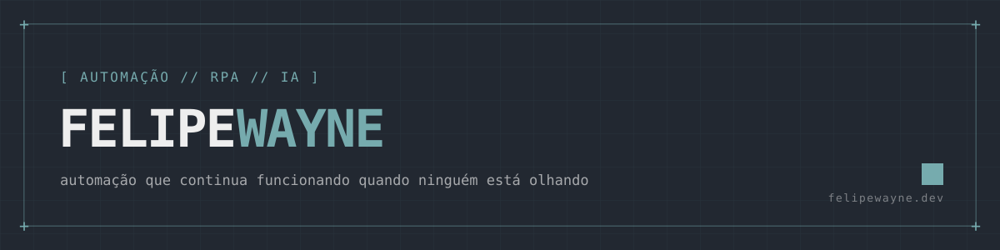

<br>

`[ SOBRE ]`

Construo automações que rodam de madrugada e continuam de pé quando ninguém está olhando. 
RPA, integrações e IA aplicada em operações de PME, quase sempre em Python. 
Também digo quando **não** vale automatizar. Isso economiza mais tempo que qualquer bot.

`[ STACK // O QUE EU REALMENTE USO ]`

 ![Playwright](https://img.shields.io/badge/Playwright-31363F?style=flat-square&logo=data:image/svg%2Bxml;base64,PHN2ZyBmaWxsPSIjRUVFRUVFIiB2aWV3Qm94PSIwIDAgMTI4IDEyOCIgeG1sbnM9Imh0dHA6Ly93d3cudzMub3JnLzIwMDAvc3ZnIj48cGF0aCBkPSJtNzIuMDg2IDg2LjEzMi0uNTk0LS4xNDRjLTEzLjEyNS0zLjg0NC0xNS4xNS0xNC4zMTEtMTUuMTUtMTQuMzExbDE4LjE4MiA1LjA4Mkw4NC4xNSAzOS43N2wtLjExNi0uMDMxYy0xMS44MDctMy4xNjItMTkuNjQtOC42OTItMjIuNzQ0LTExLjI5Mi00LjQtMy42ODUtNi4zMzUtNi4yNDYtOC4yNC0yLjM3Mi0xLjY4MiAzLjQxNy0zLjgzNiA4Ljk3Ny01LjkyIDE2Ljc2Mi00LjUxNiAxNi44NTctNy44OTIgNTIuNDI5IDIwLjAyNyA1OS45MTRsLjU3Mi4xMjl6bS0xOC44MDctMzAuODVzNC40LTYuODQzIDExLjg2Mi00LjcyMmM3LjQ2NyAyLjEyMSA4LjA0NSAxMC4zNzYgOC4wNDUgMTAuMzc2em0tOC41MTcgMjMuNDUxTDMxLjc4NyA4Mi40MXMxLjQxLTguMDI5IDEwLjk2OC0xMS4yMTJsLTcuMzQ3LTI3LjU3My0uNjM1LjE5M2MtOS4xMTEgMi40NTctMTYuNDc2IDEuODA1LTE5LjU1IDEuMjczLTQuMzU3LS43NTEtNi42MzYtMS43MDgtNi40MjIgMS42MDYuMTg2IDIuOTIzLjg4MiA3LjQ1NCAyLjQ3NyAxMy40NCAzLjQ1IDEyLjk2MSAxNC44NTQgMzcuOTM3IDM2LjQwNSAzMi4xMzJsLjYzNS0uMTk5LTMuNTU1LTEzLjMzN1pNMTkuNTQ4IDYwLjMxNWwxNS4zMTYtNC4wMzVzLS40NDYgNS44OTItNi4xODggNy40MDVjLTUuNzQzIDEuNTEyLTkuMTI4LTMuMzcxLTkuMTI4LTMuMzcxem04OS44MjQtMTguOTc5Yy0zLjk4MS42OTgtMTMuNTMyIDEuNTY3LTI1LjMzNi0xLjU5Ni0xMS44MDctMy4xNjItMTkuNjQtOC42OTItMjIuNzQ0LTExLjI5Mi00LjQtMy42ODUtNi4zMzUtNi4yNDYtOC4yNC0yLjM3Mi0xLjY4NCAzLjQxNy0zLjgzNyA4Ljk3Ny01LjkyMSAxNi43NjItNC41MTYgMTYuODU3LTcuODkyIDUyLjQyOSAyMC4wMjcgNTkuOTE0IDI3LjkxMiA3LjQ3OSA0Mi43NzItMjUuMDE3IDQ3LjI4OS00MS44NzUgMi4wODQtNy43ODMgMi45OTgtMTMuNjc2IDMuMjUtMTcuNDc2LjI4Ny00LjMwNS0yLjY3LTMuMDU1LTguMzI0LTIuMDY0ek01My4yOCA1NS4yODJzNC40LTYuODQzIDExLjg2Mi00LjcyMmM3LjQ2NyAyLjEyMSA4LjA0NSAxMC4zNzYgOC4wNDUgMTAuMzc2em0xOC4yMTUgMzAuNzA2Yy0xMy4xMjUtMy44NDUtMTUuMTUtMTQuMzExLTE1LjE1LTE0LjMxMWwzNS4yNTkgOS44NThjMC0uMDAyLTcuMTE3IDguMjUtMjAuMTA5IDQuNDUzem0xMi40NjYtMjEuNTFzNC4zOTQtNi44MzggMTEuODU0LTQuNzExYzcuNDYgMi4xMjQgOC4wNDggMTAuMzc5IDguMDQ4IDEwLjM3OXpNNTEuNzMyIDgzLjkzNXYtNy4xNzlsLTE5Ljk0NSA1LjY1NnMxLjQ3NC04LjU2MyAxMS44NzYtMTEuNTE0YzMuMTU1LS44OTQgNS44NDYtLjg4OCA4LjA2OS0uNDU5VjQwLjk5NWg5Ljk4N2MtMS4wODctMy4zNi0yLjEzOS01Ljk0Ny0zLjAyMy03Ljc0NC0xLjQ2MS0yLjk3NS0yLjk2LTEuMDAzLTYuMzYxIDEuODQyLTIuMzk2IDIuMDAxLTguNDUgNi4yNzEtMTcuNTYxIDguNzI2LTkuMTExIDIuNDU3LTE2LjQ3NiAxLjgwNS0xOS41NSAxLjI3My00LjM1Ny0uNzUyLTYuNjM2LTEuNzA4LTYuNDIyIDEuNjA1LjE4NiAyLjkyMy44ODIgNy40NTUgMi40NzcgMTMuNDQgMy40NSAxMi45NjIgMTQuODU0IDM3LjkzNyAzNi40MDUgMzIuMTMyIDUuNjI5LTEuNTE3IDkuNjAzLTQuNTE1IDEyLjM1Ny04LjMzNmgtOC4zMDlabS0zMi4xODUtMjMuNjIgMTUuMzE2LTQuMDM1cy0uNDQ2IDUuODkyLTYuMTg4IDcuNDA1Yy01Ljc0MyAxLjUxMi05LjEyOC0zLjM3MS05LjEyOC0zLjM3MXoiLz48L3N2Zz4%3D)        

`[ PROJETOS // EM DESTAQUE ]`

<a href="https://github.com/FelipeWayne/REFramework"></a> <a href="https://github.com/FelipeWayne/automation-n8n"></a>
<!-- ao tornar públicos Py-Framework-RPA / polvo-assistant, duplicar o bloco acima trocando o repo= -->

[`> ver todos os repositórios`](https://github.com/FelipeWayne?tab=repositories)

`[ GITHUB // NÚMEROS ]`

 

`[ CONTEÚDO // ÚLTIMOS POSTS ]`

<!-- placeholder: trocar por posts reais quando publicar -->

- [Título do post](https://www.linkedin.com/in/felipewayne-dev/) — LinkedIn
- [Título do post](https://www.linkedin.com/in/felipewayne-dev/) — LinkedIn
- [Título do post](https://felipewayne.dev) — felipewayne.dev


`[ CONTATO ]`

Tem alguma tarefa chata que se repete toda semana? Me conta. Se der pra automatizar, eu mostro como. Se não der, falo na lata.

```console
felipe@wayne:~$ ./contato.sh
> qual é a tarefa chata que você quer automatizar?
```

[](https://felipewayne.dev)
[](https://www.linkedin.com/in/felipewayne-dev/)
[](https://instagram.com/felipe_wayne_)
